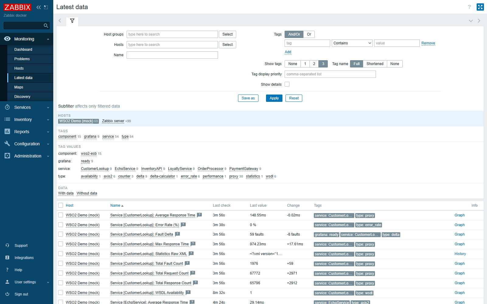
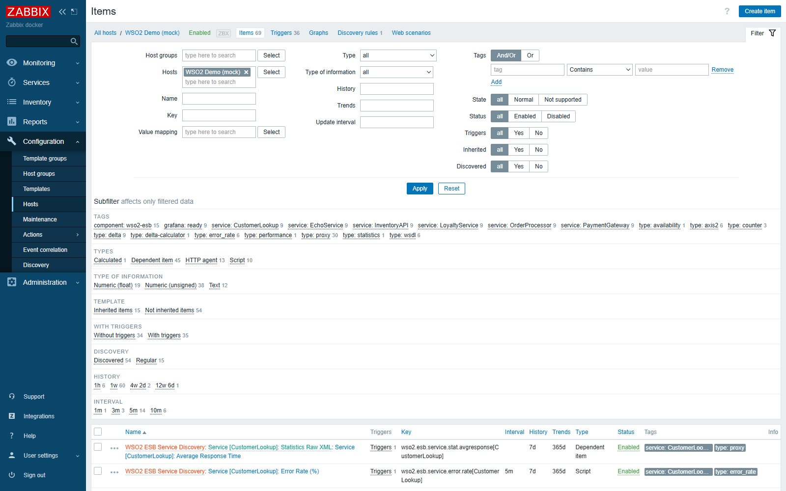
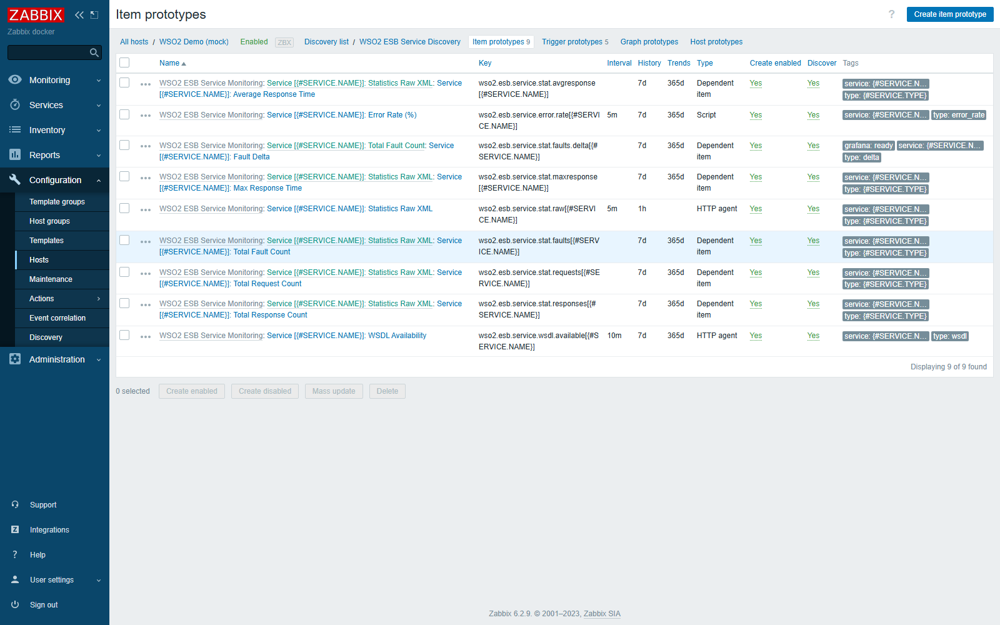
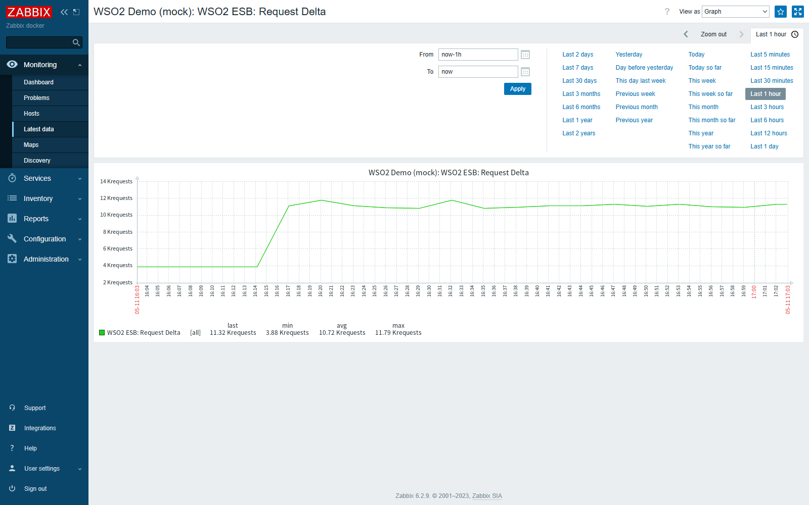
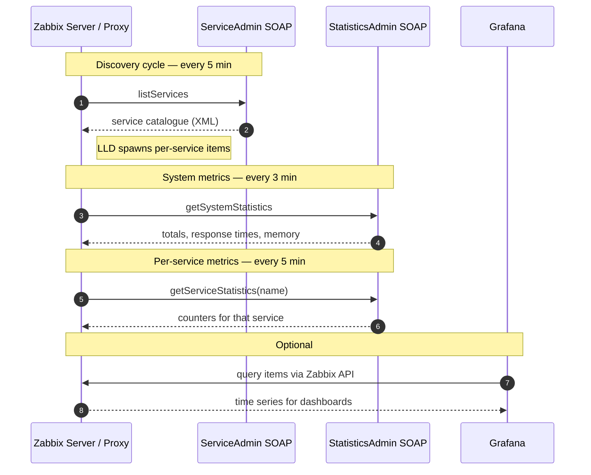

# WSO2 ESB Monitoring Template for Zabbix

## Why

There was no consistent way to monitor every service deployed on a WSO2 ESB
instance under a single standard — each metric had to be checked by hand through
the management console, and no Zabbix-native integration was available. This
template collects operational data through the SOAP Admin services
(`ServiceAdmin` for the service catalogue, `StatisticsAdmin` for counters and
response times) so all of it lives in one place.

Paired with Grafana for dashboards, the template is used day-to-day to spot
services going down, traffic spikes or unexpected drops, and periods of heavier
processing load.

## Overview

A Zabbix 6.2 template that monitors a WSO2 Enterprise Service Bus instance through
its SOAP Admin API. It auto-discovers deployed services and collects per-service
and system-wide request, response and fault counters, plus per-poll deltas.

The template performs all data collection over HTTPS to the WSO2 management port
(default `9443`), against the `ServiceAdmin` and `StatisticsAdmin` SOAP endpoints.

## Screenshots

> Captured from a demo Zabbix 6.2 deployment with a mock SOAP service exposing
> the same contract as the WSO2 ESB Carbon admin endpoints.

Latest data view, filtered to the demo host. Six services were auto-discovered
and produce 69 items, including per-poll counters and deltas:

Item list under the host. Tags surface the per-service breakdown and item
types (Dependent, HTTP agent, Script, Calculated):

Item prototypes defined by the discovery rule. Each row is created once per
discovered service:

System-wide request delta over one hour. The initial rise corresponds to the
discovery cycle bringing per-service items online:

## Requirements

- Zabbix server / proxy 6.2 or newer
- A WSO2 ESB or WSO2 Micro Integrator instance with the SOAP Admin services
  enabled
- Network reachability from the Zabbix server (or proxy) to the ESB on the
  management port (default `9443`)
- A WSO2 user with permission to call `listServices` and `getServiceStatistics`

The template uses the script item type, so script items must be enabled on the
Zabbix server / proxy that will execute it.

## Installation

1. In the Zabbix UI, go to **Configuration -> Templates -> Import**.
2. Select `zbx_export_templates.xml` and import.
3. Create or open the host that represents the WSO2 ESB instance and link the
   template `WSO2 ESB Service Monitoring`.
4. Set the user macros (see below). At minimum, `{$WSO2.HOST}`,
   `{$WSO2.SOAP.USERNAME}` and `{$WSO2.SOAP.PASSWORD}` must be configured.
5. Wait one discovery cycle (5 minutes by default) for the per-service items to
   be created.

## Macros

| Macro | Default | Purpose |
|-------|---------|---------|
| `{$WSO2.HOST}` | `wso2.example.com` | Hostname or IP of the WSO2 ESB server. |
| `{$WSO2.PORT}` | `9443` | Management port for the SOAP Admin API. |
| `{$WSO2.SOAP.USERNAME}` | `admin` | Username for SOAP Basic authentication. |
| `{$WSO2.SOAP.PASSWORD}` | *(secret)* | Password for SOAP Basic authentication. Stored as `SECRET_TEXT`. |
| `{$WSO2.ERROR.RATE.THRESHOLD}` | `5` | Error-rate percentage that triggers the high-error-rate alert. |
| `{$WSO2.MAX.RESPONSE.TIME}` | `120` | Maximum allowed response time, in seconds. |
| `{$WSO2.SYSTEM.FAULT.INCREASE.THRESHOLD}` | `100` | System-wide fault increase over 15 minutes that triggers a warning. |
| `{$WSO2.SYSTEM.FAULT.RECOVERY.THRESHOLD}` | `50` | Recovery threshold for the system-wide fault trigger. |
| `{$WSO2.SSL.CERT.EXPIRY.WARNING}` | `30` | Days before SSL certificate expiry at which a warning is raised. |
| `{$WSO2.SSL.CERT.EXPIRY.CRITICAL}` | `7` | Days before SSL certificate expiry at which a critical alert is raised. |

## What it monitors

Top-level items:

- Port 9443 availability (`wso2.esb.port.check`)
- Total service count and added/removed deltas
- Sorted service list and an inactive-services list
- System statistics JSON (server name, totals, response time, memory, uptime)
- System request, response and fault deltas (Grafana-ready)
- Overall error rate (%)

Discovery (`WSO2 ESB Service Discovery`) creates the following per-service items:

- Statistics raw XML (master item)
- Total request, response and fault counters
- Average and maximum response time
- Per-service fault delta (Grafana-ready)
- Per-service error rate (%)
- WSDL availability check

Triggers cover platform unreachability, high error rate (system and per service),
response-time spikes, sustained response-time degradation, fault count changes,
inactive services, and missing data from the ESB.

## Architecture

The Zabbix server polls two SOAP endpoints on the WSO2 management port:

- **`ServiceAdmin`** returns the catalogue of deployed services and feeds Zabbix
  low-level discovery. New services are picked up on the next discovery cycle.
- **`StatisticsAdmin`** returns system-wide and per-service counters. Successive
  polls feed per-poll deltas and the aggregate error rate.

Grafana is optional and reads from Zabbix through the standard Zabbix API.

## Compatibility

Tested with:

- Zabbix server **6.2.9**
- WSO2 ESB (Carbon-based, with SOAP Admin services enabled)

The template should work on any Zabbix 6.x release that supports script items
and HTTP agent items with `SECRET_TEXT` macros.

## License

MIT
